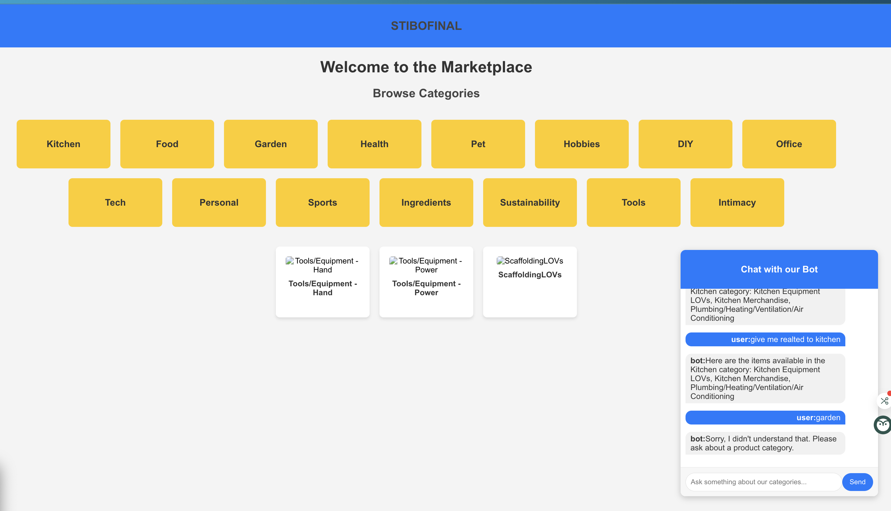

# Stibo Systems Recommendation System

## Overview
This project is a recommendation system developed to work with Stibo Systems, leveraging product data from Icecat. The system recommends products to users based on their behavior and preferences, providing an optimized browsing experience for buyers. The system integrates machine learning algorithms for clustering and dimensionality reduction to improve the recommendation quality.

### Key Features
- **Product Recommendations:** Recommends products based on user preferences and interactions.
- **Data Integration:** Uses Icecat product data to provide detailed product descriptions, specifications, and images.
- **Clustering and Dimensionality Reduction:** K-Means clustering and Truncated SVD are used to categorize and reduce the dimensions of product data for efficient recommendation.
- **Real-time Updates:** Recommends products in real-time based on user behavior and data updates from Icecat.

## Tech Stack
- **Frontend:** React.js
- **Backend:** Python, Flask
- **Machine Learning:** K-Means clustering, Truncated SVD for product recommendations
- **Data Source:** Icecat (product data)
- **APIs:** Custom APIs for recommendation serving

## Features & Functionality

### 1. **Product Recommendation Engine**
- The recommendation engine utilizes machine learning algorithms to recommend relevant products based on user preferences and past behavior.
- Icecat product data is integrated into the system, enriching the recommendations with detailed descriptions and product specifications.

### 2. **Clustering & Dimensionality Reduction**
- **K-Means Clustering:** Products are grouped into clusters based on similarities in product attributes like category, brand, and specifications.
- **Truncated SVD:** This technique reduces the dimensionality of the product data, improving the performance and efficiency of the recommendation system.

### 3. **Data Integration with Icecat**
- The recommendation system is powered by product data sourced from Icecat, which includes detailed product descriptions, specifications, and multimedia assets.
- Real-time updates from Icecat are used to refresh the product catalog and recommendations.

## Getting Started

### Prerequisites
Before you begin, ensure you have the following tools installed:
- Python 3.x
- Node.js (for React frontend)
- Docker (for backend deployment)
- Google Cloud SDK (if you plan to deploy on Google Cloud)

### 1. **Clone the Repository**
Clone this repository to your local machine.

```bash
git clone https://github.com/your-username/stibo-recommendation-system.git



